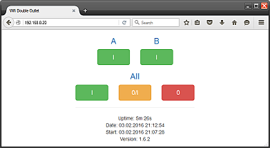
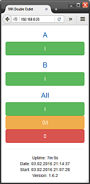

#NodeMCU-WifiDoubleSwitch<br><small>version 1.6.x</small>
NodeMCU based web server within ESP8266 for switching two pins from the web browser through WiFi. The project contains a couple of configuration files, where each of them sets up particular aspect of the project (application).

A **simple HTML templating** mechanism is used for creating various versions of HTML pages based on placeholders. HTML pages employ *Twitter Bootstrap 3.3.6.* and periodical refreshing for displaying current status of the system.


<a id="dependency"></a>
##Dependency
- **NodeMCU 1.4+**: Used appropriate mechanism for sending HTTP responses incompatible with framework version *0.9-*.
- **[s2eta](https://github.com/mrkale/NodeMCU-Modules/tree/master/s2eta)**: External module for converting elapsed seconds to a time string with *days, hours, minutes, and seconds* components.
- **[nistclock](https://github.com/mrkale/NodeMCU-Modules/tree/master/nistclock)**: External module for reading network date and time from NIST time servers.

*External modules listed above should be uploaded to the system alongside with scripts in the project.*


<a id="scripts"></a>
##Scripts
NodeMCU lua scripts. For better performance and memory efficiency all the program code is devided into separate scripts.


<a id="init"></a>
###init.lua
Initial script running at power cycle (boot) or software restart. It
- automatically compiles all *.lua* files except itself
- creates connection to a Wifi network in station mode
- reconnects to Wifi network after connection lost
- launches configuration tables from configuration files
- measures uptime (from recent restart) of the system with module [nistclock](#dependency)
- creates web server running in the ESP8266
- defines file names for used HTML templates
- contains tables with English names of week days months for generating HTTP header *Date*.


	The script uses the separate external module nistclock. 


###config_creds.lua
The script creates configuration table with credentials for preferred WiFi network as well as for web server basic HTTP authorization.
- The credential configuration table may containg IP configuration table for establishing static IP address. 
- Update values according to your situation.


###config_pins.lua
The script creates configuration table with hardware configuration. It simply defines the order of pins in HTML templates, their NodeMCU numbers, and keeps current state of pins.

The state of pins in the script is considered as the initial state after power up the ESP8266 and is predefined for active low relays initially turned off, which are expected to be controlled by the ESP8266. The numbering of pins is suitable for ESP8266-01, which the project is primarily aimed to.

*In spite of just two pins defined in the configuration table, it can be extended by whatever number of other pins with corresponding updates in HTML templates in order to control more output devices.*  


###config_switch.lua
The script creates the configuration table for rendering HTML pages with help of Bootstrap classes and the table for HTTP headers. The script also defines language independence symbols (characters) for *switching on* (I) and *switching off* (0).  
This script should be updated only if you wish to change the visual and color appearance of HTML pages and/or *assign different gpio state to pin  state*.

	Current gpio state of pins is set for low active relays.   


###processing.lua
The script processes HTTP requests, executes commands from them, and creates HTTP responses including HTTP headers from HTML templates by substituting placeholders in them with current state of pins and corresponding rendering.
Thanks to reading an HTML template from the file system at each HTTP request, the templates can be replaced on the system on the fly, which is substantially useful at tuning the HTML page or where continues working is essential.

	The script uses the separate external module s2eta. 


[Back to scripts](#scripts)


<a id="templates"></a>
##Templates
HTML templates for the web server running within the ESP8266 module.


###tmpl_page.html
The default name of the regular HTML template for control pins. Different template variation has to be renamed to this default name. The default name can be changed in the script [init.lua](#init).

- The template uses Twitter Bootstrap 3.3.6 framework imported from CDN.
- The template is fully responsive and is designed primarily for small devices.
- The template does not import Bootstrap javascripts.
- The placeholders of the template are based on linux command shell variable substitution (*${varname}*).
- Bellow the bottom line there is displayed this information:
	- Uptime in AT format since start time
	- Current system time
	- Start time of recent system (re)start
	- Version of the application


######Layout for medium and large devices



######Layout for small and extra small devices


The template has a meta tag defined for refreshing the HTML page every 10 seconds in order to display the current state of the system.

```html
<meta http-equiv="refresh" content="10; url=/">
```

The *content* value defines the refresh interval in seconds and the value of *url* ensures, that refreshing does not change the status of pins, just reads the current status of them. It is useful then multiple users control the system concurrently. 
	

###tmpl_err.html
The HTML template for failed authorization to the web server.


[Back to templates](#templates)


<a id="folder_templates"></a>
##Folder "templates"

This folder contains other HTML template variations and their language mutations.

- HTML templates in languages with diacritical characters should be coded in UTF-8.
- Templates in this folder should be renamed to names aforementioned in chapter [templates](#templates) in order to use them in the application, i.e., variation and language suffixes should be removed from file names.


###tmpl_page_twofull_en.html
English mutation of the primary HTML template for control two pins individually as well as both of them at once including toggling them.


###tmpl_page_twofull_sk.html
Slovak mutation of the previous template.


###tmpl_page_twosimple_en.html
English mutation of the simplified HTML template for control two pins individually only, i.e., **without** control and toggling them at once. 


###tmpl_page_twosimple_sk.html
Slovak mutation of the previous template.


###tmpl_page_one_en.html
English mutation of the trivial HTML template for control just one (the first) pin.


###tmpl_page_one_sk.html
Slovak mutation of the previous template.


###tmpl_err_en.html
English mutation of the HTML template for failed authorization to the web server.


###tmpl_err_sk.html
Slovak mutation of the previous template.


[Back to folder Templates](#folder_templates)
